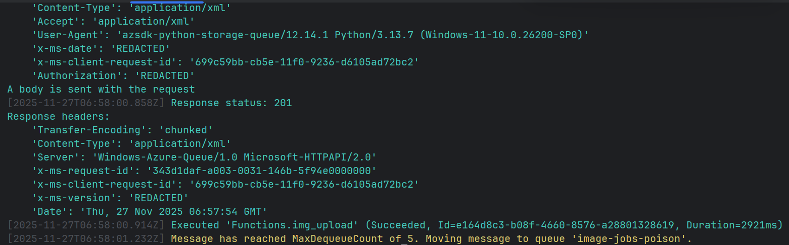

# Storage Queue Image Pipeline

This Azure Functions app provides a two-step pipeline: an HTTP endpoint uploads images to Blob Storage and enqueues resize jobs, while a queue-triggered worker creates multiple thumbnails in a separate container. The solution is ideal for lightweight product image processing or any workflow that needs dependable background resizing.


## Architecture
- `img_upload` (`POST /api/upload`): Validates multipart uploads, saves images to the `BLOB_CONTAINER`, and enqueues resize instructions to `QUEUE_NAME` in the same storage account.
- `auto_resize_image` (queue trigger): Consumes messages, downloads the source blob, generates `sizes` thumbnails (defaults to 320px and 1024px), and writes them to `RESIZED_CONTAINER/<size>/filename`.
- Azure Storage handles both blob and queue operations through the shared `AzureWebJobsStorage` connection string.

## Function Details
| Function | Trigger | Inputs | Outputs |
| --- | --- | --- | --- |
| `img_upload` | HTTP (`function` auth) | Multipart image request | Blob (original image) and queue message containing `{ blobUrl, sizes }` |
| `auto_resize_image` | Queue (`image-jobs`) | `blobUrl`, `sizes[]` | Resized blobs stored under `RESIZED_CONTAINER` |

## Configuration (`local.settings.json`)
| Setting | Purpose |
| --- | --- |
| `AzureWebJobsStorage` | Primary storage account for blobs and queue trigger binding |
| `BLOB_CONTAINER` | Container for original uploads (default `uploads`) |
| `RESIZED_CONTAINER` | Container for generated thumbnails (default `resized`) |
| `QUEUE_NAME` | Name of the resize job queue (default `image-jobs`) |

> **Note:** Replace the sample connection strings with your own storage account or Azurite emulator credentials before running in production.

## Local Setup
1. Python 3.10+ and the Azure Functions Core Tools (`func`) are required.
2. Create a virtual environment and install dependencies:
   ```powershell
   python -m venv .venv
   .\.venv\Scripts\activate
   pip install -r requirements.txt
   ```
3. Start the Functions host:
   ```powershell
   func start
   ```

## Testing the HTTP Upload
- Use Postman or curl to send a multipart `POST` to `http://localhost:7071/api/upload` with the file field (any name is accepted).
- Successful uploads respond with the blob name and confirmation that a queue message was added.
- The queue trigger logs each resize cycle (see `terminal_output.png` above for a sample run). A sample Postman request screenshot is available at `postman_request.png`.


Messages in the queue look like this:
```json
{
  "blobUrl": "https://<your_storage_account>.blob.core.windows.net/uploads/your_image.jpg",
  "sizes": [320, 1024]
}
```

