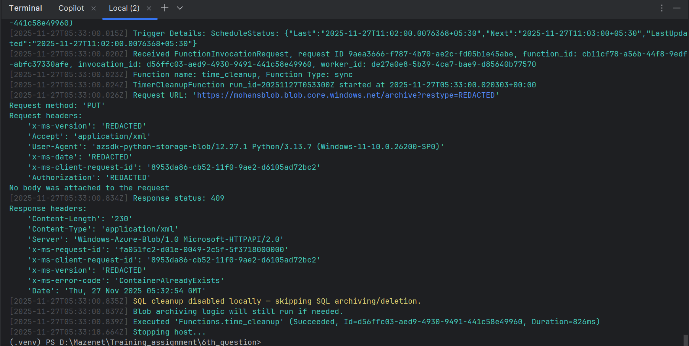

# Timer Cleanup Function

This project contains an Azure Functions timer-triggered workflow that archives and purges aged `Orders` rows from SQL into Azure Blob Storage. Use it to keep the transactional table lean while retaining raw data in cheaper blob storage (line-delimited JSON).

---

## Table of Contents
1. [Solution Overview](#solution-overview)
2. [Project Layout](#project-layout)
3. [Prerequisites](#prerequisites)
4. [Configuration](#configuration)
5. [Database Prep](#database-prep)
6. [Local Development](#local-development)
7. [Azure Resource Setup](#azure-resource-setup)
8. [Deployment](#deployment)
9. [Monitoring & Verification](#monitoring--verification)
10. [Troubleshooting](#troubleshooting)
11. [FAQ & Tips](#faq--tips)

---

## Solution Overview
- **Trigger**: Timer trigger defined in [`time_cleanup/function.json`](time_cleanup/function.json); default schedule runs every 24 hours at 01:00 UTC (`0 0 1 * * *`).
- **Source**: SQL table `Orders` (schema in [`scripts/orders_table.sql`](scripts/orders_table.sql)). Rows older than `DAYS_OLD` days (default 30) are selected in batches of `BATCH_SIZE`.
- **Archive**: Rows are serialized to NDJSON in `orders/<yyyy>/<mm>/<dd>/orders-<timestamp>.ndjson` blobs inside `ARCHIVE_CONTAINER` (default `archive`).
- **Purge**: After upload, the same rows are deleted from SQL to keep the table lean.
- **Observability**: Function logs total archived rows and each blob URL; errors roll back the SQL transaction and leave rows untouched.

---

## Project Layout
```
6th_question/
├─ host.json                    # Global Azure Functions settings
├─ local.settings.json          # Local dev secrets (not for production)
├─ requirements.txt             # Python dependencies
├─ scripts/
│  └─ orders_table.sql          # Table definition + index
└─ time_cleanup/
   ├─ __init__.py               # Timer function implementation
   └─ function.json             # Trigger schedule metadata
```

---

## Prerequisites
- Python 3.11+ (functions runtime currently bundles 3.11, adjust if needed).
- Azure Functions Core Tools v4 for local testing (`func` CLI).
- Azure CLI (optional) for publishing and resource management.
- Access to:
  - Azure Blob Storage account (connection string).
  - Azure SQL Database or SQL Server instance with the `Orders` table.
- Drivers for `pyodbc`:
  - Windows: install ODBC Driver 18 for SQL Server (or compatible).
  - Linux/macOS: ensure `unixODBC` + Microsoft ODBC driver are installed.

### Python Dependencies (`requirements.txt`)
The function runtime installs everything in [`requirements.txt`](requirements.txt). Keep this file in sync with your code imports:
```
azure-functions
azure-storage-blob
pyodbc
```
Install/update locally with:
```powershell
pip install -r requirements.txt
pip freeze > requirements.lock.txt  # optional: capture exact versions
```

---

## Configuration
Declare these values in `local.settings.json` (local) or Function App configuration (production):
#### Sample `local.settings.json`
```json
{
  "IsEncrypted": false,
  "Values": {
    "AzureWebJobsStorage": "UseDevelopmentStorage=true",
    "FUNCTIONS_WORKER_RUNTIME": "python",
    "SQL_CONN_STR": "Driver={ODBC Driver 18 for SQL Server};Server=tcp:sample-sql.database.windows.net,1433;Database=ordersdb;Uid=app_user;Pwd=<secret>;Encrypt=yes;TrustServerCertificate=no;",
    "ARCHIVE_CONTAINER": "archive",
    "BATCH_SIZE": "1000",
    "DAYS_OLD": "30",
    "DISABLE_SQL": "false"
  }
}
```
> Replace placeholders with your real values; never check secrets into source control.

---

## Database Prep
1. Create the table and index:
   ```sql
   :r scripts/orders_table.sql
   ```
2. Seed sample rows (optional) to simulate data older than `DAYS_OLD`. Ensure the `createdOn` timestamps are >30 days in the past so they qualify for archiving.
3. Validate permissions: the SQL login used in `SQL_CONN_STR` must have `SELECT`, `DELETE`, and optionally `INSERT` (for manual seeding) on `Orders`.

### Table Definition SQL
```sql
CREATE TABLE Orders (
  id NVARCHAR(100) PRIMARY KEY,
  customerId NVARCHAR(100),
  name NVARCHAR(255),
  price DECIMAL(18,2),
  createdOn DATETIME2 NOT NULL DEFAULT SYSUTCDATETIME(),
  updatedOn DATETIME2 NULL,
  otherJson NVARCHAR(MAX) NULL -- store any other fields as JSON text
);

CREATE INDEX IDX_Orders_CreatedOn ON Orders(createdOn);
```
> The same script lives in `scripts/orders_table.sql`; run it directly or include via `:r scripts/orders_table.sql` when using sqlcmd/Azure Data Studio.

---

## Local Development
1. **Install dependencies**
   ```powershell
   python -m venv .venv
   .\.venv\Scripts\Activate
   pip install -r requirements.txt
   ```
2. **Configure settings**: update `local.settings.json` with the connection strings and runtime settings listed above.
3. **Dry run (no SQL)**
   ```powershell
   setx DISABLE_SQL true
   func start
   ```
   Observe the log showing the warning and early exit.
4. **Full run** (ensure `DISABLE_SQL` not set):
   ```powershell
   func start
   ```
   - The timer trigger fires shortly after startup; use `func host start --verbose` to force immediate execution or add an HTTP trigger for manual invocation during development.
   - Confirm log entries for fetched batches, blob uploads, and deletions.

---

## Azure Resource Setup
Run these Azure CLI commands (adjust names/locations) before deploying:
```powershell
az group create -n rg-orders-archive -l eastus
az storage account create -n <storageName> -g rg-orders-archive -l eastus --sku Standard_LRS
az sql server create -n <sqlServerName> -g rg-orders-archive -l eastus -u sqladmin -p <Password123>
az sql db create -n ordersdb -g rg-orders-archive -s <sqlServerName> -e Basic -c 5 -u 5
az functionapp create -n <funcAppName> -g rg-orders-archive -s <storageName> -p <planName> --runtime python --runtime-version 3.11
```
Then set configuration values on the Function App:
```powershell
az functionapp config appsettings set -n <funcAppName> -g rg-orders-archive --settings \
  AzureWebJobsStorage="<storage-connection-string>" \
  SQL_CONN_STR="<sql-connection-string>" \
  ARCHIVE_CONTAINER="archive" \
  BATCH_SIZE="1000" \
  DAYS_OLD="30"
```
Finish by creating the archive container:
```powershell
az storage container create -n archive --account-name <storageName>
```

---

## Deployment
1. Create Azure resources (storage account, Function App, SQL DB).
2. Configure required app settings (`AzureWebJobsStorage`, `SQL_CONN_STR`, etc.).
3. Publish the function:
   ```powershell
   func azure functionapp publish <function-app-name>
   ```
4. Verify the timer schedule in the Azure Portal under Function App ➜ Functions ➜ `time_cleanup` ➜ Integrate.

---

## Monitoring & Verification
- **Function Logs**: Stream via `func azure functionapp logstream <name>` or App Insights.
- **Blob Storage**: Check the `ARCHIVE_CONTAINER` for NDJSON files, confirm each file size roughly matches the number of rows logged.
- **SQL Audit**: Run:
  ```sql
  SELECT COUNT(*) FROM Orders WHERE createdOn < DATEADD(day,-30,GETUTCDATE());
  ```
  before and after execution to see the delta.
- **Metrics**: Enable Application Insights to chart execution count, failures, and duration.

### Sample Terminal Output


---

## Troubleshooting

